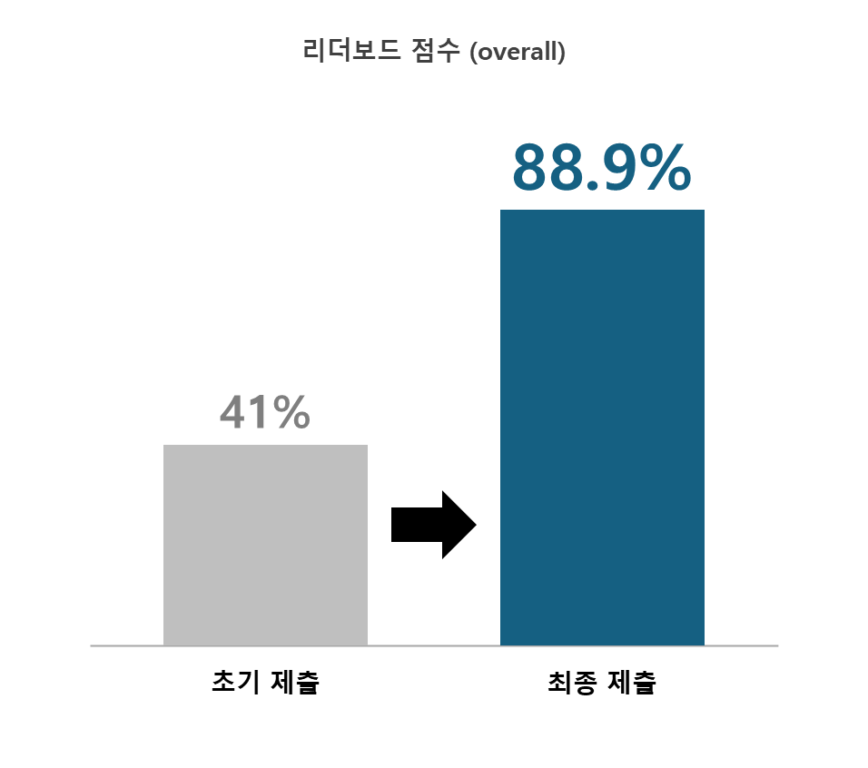
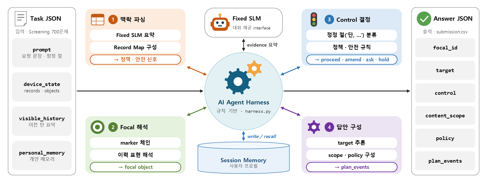

# 2026 Samsung AI Challenge – AI Agent Harness

## 프로젝트 소개 & 주요 성과
[2026 Samsung Collegiate Programming Challenge : AI 챌린지](https://dacon.io/competitions/official/236730/overview/description)에 참가하여, 개인 기기 Agent가 마주치는 요청 맥락을 해석하고 판단과 실행 계획을 정해진 형식의 답안으로 생성하는 **규칙 기반 AI Agent Harness**를 설계·구현한 코드를 공유합니다.

- `harness.py`는 `FinalHarness.answer_task(task, session)` 하나로 task의 `prompt`, `device_state`(objects·records), `visible_history`, `personal_memory`와 세션 상태를 해석해 구조화된 답안을 만듭니다. 외부 LLM/API 없이 **Python 표준 라이브러리만** 사용하는 결정론적 구현입니다.
- `run_submission.py`는 task JSONL을 `(session_id, turn_index, task_id)` 순으로 정렬하고, 세션별 상태를 유지하며 Harness를 실행한 뒤, 답안 구조를 검증하고 `submission.csv`를 생성합니다.
- `evaluate_dev.py`는 공개 dev 데이터에 대한 회귀 검증 스크립트입니다. (대회에서 제공한 로컬 채점 코드가 필요하며, 해당 코드는 리포지터리에 포함하지 않았습니다.)

### 최종 성과
리더보드 점수(overall)를 **0.41 → 0.8891** 로 향상시켰으며, 전체 1,843명 중 **46위(상위 3%)** 를 기록했습니다.

<p align="center">
  
</p>

---

## 과제 개요
- **주제**: AI Agent Harness 설계를 통한 창의적 문제 해결 (주최: 삼성전자 / 주관: 삼성리서치 / 운영: 데이콘)
- **입력 (task JSON)**: `prompt`, `device_state`(`objects`, `records`), `visible_history`, `personal_memory`
- **출력 (answer JSON)**: `focal_id`, `target`, `control`(`proceed | amend | hold | ask`), `content_scope`, `policy`, `plan_events`
- **평가**: Public Screening 700개 과제의 답안을 서버에 보관된 정답과 비교해 산출한 overall 점수
- **제약**: 대회가 제공하는 fixed SLM interface(`FixedSLMClient`)만 사용할 수 있고, 외부 LLM API·네트워크 호출과 특정 task에 대한 하드코딩은 금지됩니다. 따라서 성능 차이는 모델이 아니라 **Harness 설계**에서 나옵니다.

---

## 리포지터리 구성
```
2026_Samsung_AI_Challenge/
├── harness.py            # FixedSLMClient facade + FinalHarness (규칙 기반 Agent Harness)
├── run_submission.py     # task JSONL 실행 → 답안 구조 검증 → submission.csv 생성
├── evaluate_dev.py       # dev 데이터 회귀 검증 (대회 제공 로컬 채점 코드 필요)
├── requirements.txt      # 외부 의존성 없음 (표준 라이브러리만 사용)
├── assets/               # README용 다이어그램
├── .gitignore / LICENSE
└── README.md
```

---

## 기술 스택
- **언어**: Python 3.10+ (제출물 생성·검증 환경: Python 3.12.13)
- **사용 모듈**: `re`, `json`, `csv`, `argparse`, `pathlib`, `typing` 등 표준 라이브러리
- **외부 모델/API**: 사용하지 않음 (대회 제공 `FixedSLMClient` local facade만 사용)
- **재현성**: 난수·샘플링이 없는 결정론적 실행 (동일 입력 → 동일 `submission.csv`)

---

## 데이터셋
대회 데이터(`dev_tasks.jsonl` 120문항, `dev_answers.json`, `screening_tasks.jsonl` 700문항, `submission_schema.json`, baseline 노트북 등)는 대회 규정상 재배포할 수 없어 **리포지터리에 포함되어 있지 않습니다.** [대회 페이지](https://dacon.io/competitions/official/236730/overview/description)의 데이터 탭에서 내려받아야 합니다.

> **주의:** 본 리포지터리는 **코드 공유 목적**으로 유지됩니다. 실행하려면 대회 데이터를 로컬에 준비하고 경로를 인자로 넘겨야 합니다.

---

## Harness 구조 및 동작 흐름

<p align="center">
  
</p>

1. **맥락 파싱**
   - `FixedSLMClient.summarize_task()`로 task의 보조 evidence(risk flag, audit tag 등)를 요약합니다. 이 결과는 답안의 `audit_tags`에만 쓰이고, 나머지 구조 필드는 모두 Harness의 규칙이 직접 만듭니다.
   - `device_state.records`를 `type → value` 형태의 Record Map으로 바꿔 공유 정책, 권한 확인, 안전·보안 신호를 읽습니다.
2. **Focal 해석 (`choose_focal`)**
   - ① marker 체인(`focal_marker_refs` → `focal_resolution_trace` → `route_binding_order`)
   - ② `visible_history`의 지정형 표현("기준 참조는 …", "…로 고정")과 서수형 표현("두 번째 후보만", "가운데 항목만")
   - ③ record 값이 직접 가리키는 object id → ④ prompt 토큰 겹침 순으로 중심 object를 결정합니다.
3. **Control 결정 (우선순위 cascade)**
   - "단, …" 형태의 최신 정정 절을 **중단 / 사용자 확인 / 로컬 처리 / 요약 한정** 네 가지 의미로 분류합니다.
   - 이어서 안전·보안·동의 → 메모리 충돌·대상 변경 → 권한(authority) → 모호성 → 공유 정책 순으로 `proceed | amend | hold | ask` 중 하나를 정합니다.
4. **답안 구성**
   - `infer_target`: 수신처·채널·장치·메모리 저장소 등 최종 대상 결정
   - `build_content_scope`: 공개 범위(mode), 허용·제외 필드, 사용자 확인 필요 여부
   - `build_policy`: risk flags, violations, confirmation
   - `build_plan_events`: read / guard / clarify / redact / summarize / dispatch / verify / update 계획 단계
5. **Session Memory**
   - `persistent_memory_write` record의 사용자 프로필을 저장해 두고, 이후 turn의 `persistent_memory_recall`에서 `memory_key` → person 순으로 조회해 target과 control 판단에 반영합니다.

---

## 개선 과정
| 단계 | 리더보드 overall | 내용 |
|------|-----------------:|------|
| 초기 제출 | 0.41 | 첫 제출 |
| dev 정답에 맞춘 규칙 | 0.63 | dev 120문항에서는 로컬 채점 만점(0.96)이었지만 리더보드에서는 일반화되지 않음 |
| 일반화 재설계 (최종) | **0.8891** | 문장 암기 대신 구조화 record와 의미 단위 분류로 판단 |

- **과적합 진단**: 로컬 채점은 focal이 틀리면 나머지 항목이 모두 0점이 되고, target·control이 틀리면 content_scope·policy·plan이 0점이 되는 게이팅 구조입니다. dev 예시 문장에 맞춘 규칙은 앞 단계에서 한 번 틀리면 뒤 항목 점수를 모두 잃었습니다.
- **재설계 방향**
  - 정정 절을 문장 단위로 외우지 않고, 키워드 조합으로 의미(중단·확인·로컬·요약 한정)를 분류
  - focal을 marker 체인과 이력 표현(지정형·서수형)으로 해석하는 일반 규칙으로 정리
  - 같은 의미를 가진 record 값을 하나로 묶어 처리 (예: `internal_binding_confirmed`와 `local_authority_confirmed`를 모두 "권한 확정"으로 취급)
  - record 값이 식별자만 담고 있을 때는 prompt에서 사용자 프로필을 파싱해 세션 메모리에 저장

---

## 사용 방법
1. **환경 구성**
   ```bash
   python --version   # 3.10 이상
   ```
   별도 패키지 설치는 필요하지 않습니다.
2. **데이터 준비**
   - 대회 데이터 탭에서 `screening_tasks.jsonl`(필수), `dev_tasks.jsonl`·`dev_answers.json`(선택)을 내려받습니다.
3. **제출 파일 생성**
   ```bash
   python run_submission.py /path/to/screening_tasks.jsonl -o submission.csv
   ```
   정상 완료 시 `wrote submission.csv (700 answers)`가 출력됩니다. 저장 전에 task ID 일치, focal object 존재 여부, 필수 필드와 enum, scope/policy 타입, plan event 구조를 검사합니다.
4. **dev 회귀 검증 (선택)**
   ```bash
   python evaluate_dev.py /path/to/dev_tasks.jsonl /path/to/dev_answers.json
   ```
   대회 baseline 노트북에 포함된 로컬 채점 코드를 `scoring.py`로 같은 폴더에 두어야 실행됩니다.
5. **코드에서 직접 호출**
   ```python
   from harness import FinalHarness

   harness = FinalHarness()
   session = {}
   answer = harness.answer_task(task, session)
   ```

---

## 실험 가능 여부 체크
- **가능**: 대회 데이터(`screening_tasks.jsonl` 등)를 로컬에 준비하고 경로를 인자로 넘기면 제출 파일 생성과 구조 검증이 가능합니다.
- **불가능**: 데이터가 없는 상태에서는 실행할 수 없습니다. dev 회귀 검증은 대회 제공 로컬 채점 코드가 있어야 합니다. (리포지터리는 코드 공유 목적)

---

## 핵심 결과
- **리더보드 overall**: `0.8891` (Public Screening 700개 과제)
- **순위**: 1,843명 중 46위 (상위 3%)
- **dev 회귀 검증**: 로컬 채점 `0.9600` — 로컬 채점기는 semantic response 축(0.04)을 채점하지 않아 0.96이 최댓값입니다.
- **구현 특징**: 외부 모델·API·네트워크 호출 없음 / task_id·session_id별 정답 매핑 없음 / 결정론적 실행

---
